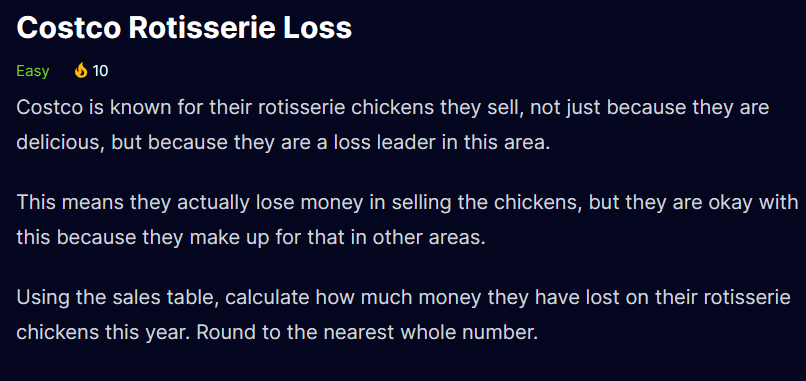

```sql
SELECT TOP 1 *,
(CAST(car_price AS DECIMAL(10,2))-CAST(production_cost AS DECIMAL(10,2))) 
* CAST(cars_sold AS DECIMAL(10,2)) AS Profit
FROM tesla_models
ORDER BY profit DESC
```


```sql
SELECT * 
FROM patients
WHERE age > 50 AND cholesterol >= 240 AND weight >=200
ORDER BY cholesterol DESC
```


```sql
SELECT COUNT(*) as total_customer
FROM customers
WHERE age>65 or total_purchase > 200    
```


```sql
SELECT store_id , ROUND(AVG(CAST(revenue AS DECIMAL(10,2))),2)AS Average_Revenue
FROM stores
GROUP BY store_id
HAVING AVG(revenue) > 1000000
ORDER BY store_id
```
- **NOTE** : The ROUND(number,decimal_we_want) function rounds a number to a specified number of decimal places.


```sql
select video_id
FROM youtube_videos
WHERE CAST(thumbs_up AS DECIMAL(10,2))
    /CAST((thumbs_up+thumbs_down) AS DECIMAL(10,2)) < 0.55
ORDER BY video_id
```


```sql
SELECT  * 
FROM bakery_items
WHERE product_name LIKE '%Chocolate%'
```


```sql
SELECT TOP 3 employee_id 
FROM employees
ORDER BY birth_date 
```

```sql
SELECT bread_name,meat_name FROM bread_table b
JOIN meat_table m ON b.bread_id = m.meat_id  
  OR b.bread_id != m.meat_id
ORDER BY bread_name,meat_name 
```

```sql
SELECT COUNT(*) AS total_no_of_bikes
FROM bikes
WHERE miles >= 10000
```

```sql
SELECT owner_name, vehicle
FROM inspections
WHERE minor_issues <= 3 AND critical_issues = 0
ORDER BY owner_Name
```

```sql
SELECT candidate_id 
FROM candidates
WHERE sql_experience = 'X' AND problem_solving = 'X' AND domain_knowledge ='X'
      AND (python ='X' OR r_programming ='X')
ORDER BY 1
```

```sql
SELECT ROUND(SUM(lost_revenue_millions),0) AS loss 
FROM sales;
```