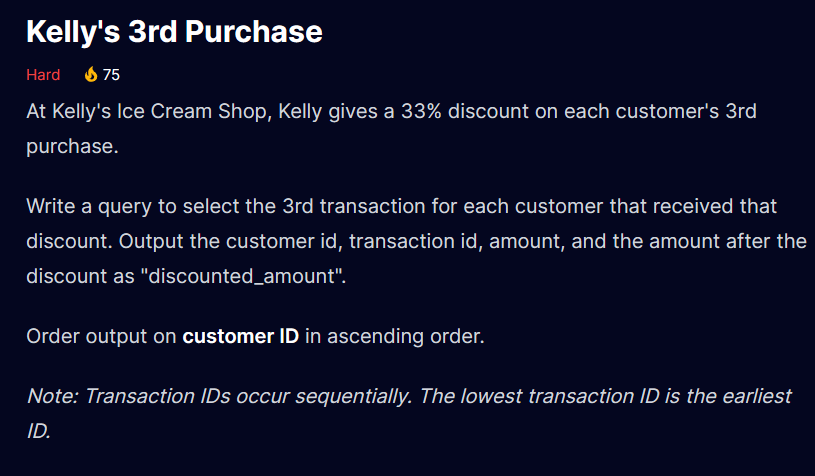
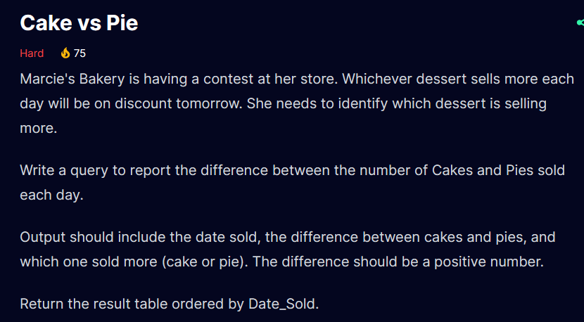

```sql
WITH CTE AS (
SELECT customer_id,transaction_id,amount,
  ROW_NUMBER() OVER(PARTITION BY customer_id
  ORDER BY transaction_id) AS Transaction_Rank
FROM purchases
)
SELECT customer_id,transaction_id,amount, amount * (1 - 0.33) AS discounted_amount FROM CTE 
WHERE transaction_rank = 3
ORDER BY customer_id
```

```sql
SELECT
  date_sold,
  ABS(SUM(CASE WHEN product = 'Cake' THEN amount_sold ELSE 0 END)-
  SUM(CASE WHEN product = 'Pie' THEN amount_sold ELSE 0 END)) AS difference,
  CASE
        WHEN SUM(CASE WHEN product = 'Cake' THEN amount_sold ELSE 0 END) >
            SUM(CASE WHEN product = 'Pie' THEN amount_sold ELSE 0 END)
        THEN 'Cake'
        ELSE 'Pie'
  END AS sold_more
FROM desserts
GROUP BY date_sold
```