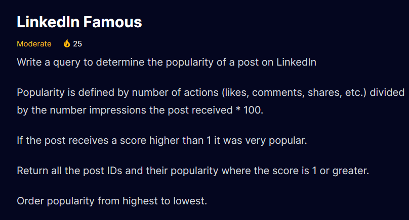
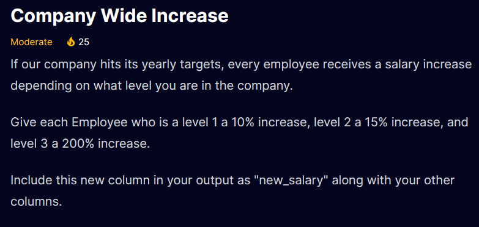
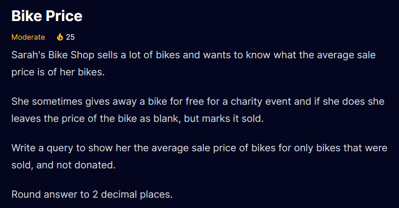
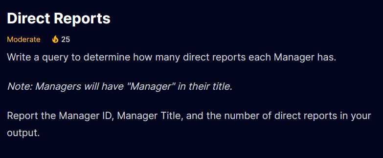
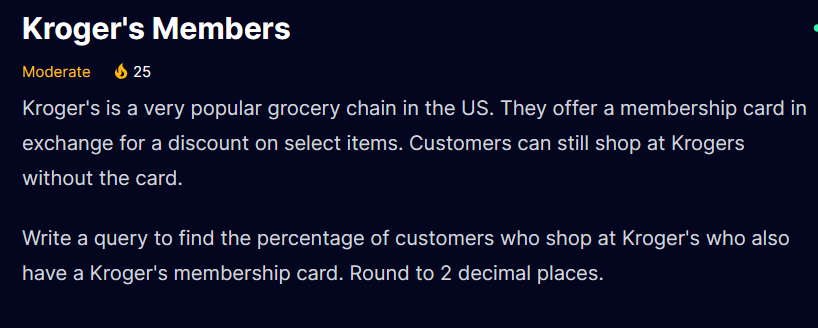
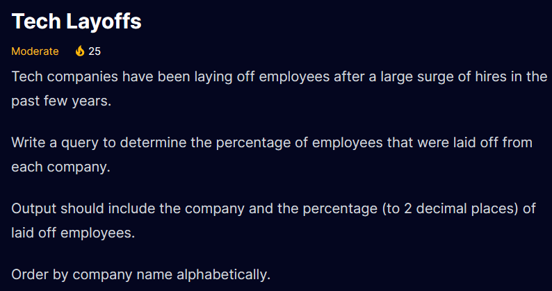
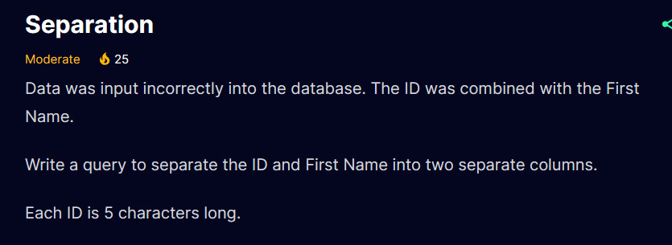
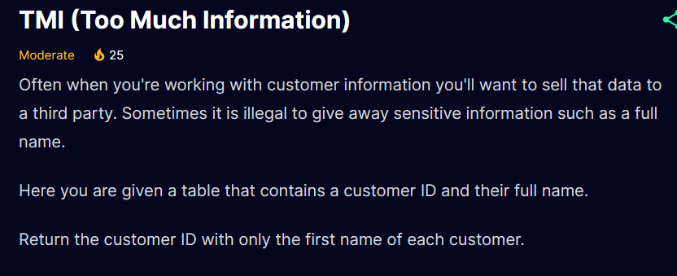

- DATEDIFF function is used to calculate the difference between the date.
- DATEDIFF function takes 3 arguments (Interval,Start_Date,End_Date)
- Interval --> Year,Month,Day,Minute,Seconds etc.

```sql
SELECT customer_id
FROM customers
WHERE DATEDIFF(YEAR,birth_date,'2023-1-1') -1 >= 55
ORDER BY 1
```
- Note : Subtracting 1 (- 1) adjusts the result by one year. This adjustment is typically done to include customers who have not yet reached their birthday in the current year but will turn 55 during the year.
- For example, if a customer's birthday is later in the year, and the current date is before their birthday in '2023-01-01', the initial calculation might not yet reflect that they have turned 55. Subtracting 1 ensures that they are included in the result set.



```sql
SELECT post_id , 
  (CAST(actions AS DECIMAL(10,2))/CAST(impressions AS DECIMAL(10,2))) *100 AS popularity_rate
FROM linkedin_posts
WHERE (CAST(actions AS DECIMAL(10,2))/CAST(impressions AS DECIMAL(10,2))) *100 > 1
ORDER BY popularity_rate DESC
```



```sql
SELECT  * ,
  CASE WHEN pay_level = 1 THEN salary *(1+0.10)  --(10/100 =0.10)
       WHEN pay_level = 2 THEN salary *(1+0.15) 
       WHEN pay_level = 3 THEN salary *(1+2)  
  END AS new_salary
FROM employees;
```
- **NOTE** : The CASE expression goes through conditions and returns a value when the first condition is met (like an if-then-else statement)


```sql
SELECT first_name
FROM users u 
JOIN user_time t ON u.user_id = t.user_id
WHERE media_time_minutes > (SELECT AVG(CAST(media_time_minutes AS DECIMAL(10,2))) FROM user_time)
ORDER BY 1;

--- Sub query in where condition return the average media time from
---table and over all result is filter based on that average value
```


``` sql
SELECT  ROUND(AVG(bike_price),2) AS average_price
FROM inventory
WHERE bike_sold = 'Y'
```

```sql
SELECT dr2.employee_id AS manager_id, dr2.position AS manager_position, 
        COUNT(*) AS direct_reports
FROM direct_reports dr1
JOIN direct_reports dr2 ON dr1.managers_id = dr2.employee_id
WHERE dr2.position LIKE '%Manager%'
GROUP BY dr2.employee_id, dr2.position;
```


```sql 
WITH CTE AS (
SELECT  region,SUM(fast_food_millions) AS total_spend
FROM food_regions
GROUP BY region
)
SELECT TOP 1 region 
FROM CTE
ORDER BY total_spend DESC
```
- **NOTE**: A common table Expression CTE is a powerful SQL construct that helps simplify queries. CTEs act as virtual tables (with records and columns) that are created during query execution, used by the query, and deleted after the query executes.



```sql
SELECT 
ROUND((CAST(COUNT(has_member_card) AS DECIMAL(10,2))
      /CAST(COUNT(*) AS DECIMAL(10,2)))*100,2) AS Percentage_customer
FROM customers
```

```sql
SELECT company,
       ROUND((CAST(employees_fired AS DECIMAL(10,2))
       /CAST(company_size AS DECIMAL(10,2)))*100,2) AS Percentage_Laid_Off
FROM tech_layoffs
ORDER BY company
```


```sql
SELECT  
    LEFT(id, 5) AS ID, 
    RIGHT(id, LEN(id) - 5) AS First_Name
FROM 
    bad_data;

```


```sql
SELECT Customer_ID, 
  TRIM(LEFT(Full_Name, CHARINDEX(' ', Full_Name) - 1)) AS First_Name
FROM customers;

```